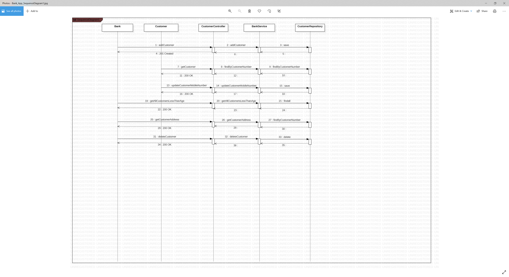

# Spring Boot Banking Application for managing Customers

REST API to simulate the CRUD operations for a banking customer. 

## Requirements

*	Create a bank customer.
*	Retrieve a customer details.  
*	Update a customer's mobile number.
*   Retrieve all customers below 18 years of age.
*   Retrieve a customer's address.
*   Delete a customer. 


## Getting Started

1. Checkout the project from GitHub
```
git clone https://github.com/
```
2. Enable Lombok support on your IDE
3. Open IDE of your choice and Import as existing maven project in your workspace
4. Default port for the api is 8989


### Prerequisites/Tools Required

* Java 11
* IntelliJ
* Maven (version 4)
* Mockito
* Junit  
* Postman 

### Maven Dependencies

```
spring-boot-starter-actuator
spring-boot-starter-data-jpa
spring-boot-starter-security
spring-boot-starter-web
spring-boot-devtools
h2 - Inmemory database
lombok - to reduce boilerplate code
springfox-swagger2
springfox-swagger-ui
spring-boot-starter-test
spring-security-test

```

## Swagger

Please find the Rest API documentation in the below url
```
http://localhost:8989/bank-api/swagger-ui.html
```

## H2 In-Memory Database

Make sure to use jdbc:h2:mem:testdb as your jdbc url. If you intend to you use custom database name, please
define datasource properties in application.yml
```
http://localhost:8989/bank-api/h2-console/
```

## Testing the Bank APP Rest Api
```
1. Import the Postman collection Test-Bank-API.postman_collection into the application.
2. Sample requests to add customers are also present in <project-root>/src/main/resources .
```

## URL and Sample Requests for different UC.
### UC1 - Create a customer
POST http://localhost:8989/bank-api/customers
```
{
"contactDetails": {
"emailId": "roger@test.com",
"mobilePhone":"123456789",
"homePhone": "8470000000",
"workPhone": "8471112222"

},
"customerAddress": {
"address1": "123 McKee Ave",
"address2": "UNIT 4",
"city": "Chicago",
"country": "USA",
"state": "IL",
"zip": "60076"
},
"customerNumber": 1001,
"firstName": "Roger",
"lastName": "Federer",
"middleName": "D",
"dateOfBirth": "2011-10-10",
"status": "Active"
}
```
### UC2 - Retrieve a customer details
GET http://localhost:8989/bank-api/customers/1001

### UC3 - Update a customer's mobile number.
PUT http://localhost:8989/bank-api/customers/1001
```
{
  "contactDetails": {
    "mobilePhone": "123456781"
  }
}
```
### UC4 - Retrieve all customers below 18 years of age
GET http://localhost:8989/bank-api/customers/age?lt=18

### UC5 - Retrieve a customer's address
GET http://localhost:8989/bank-api/customers/1001/address

### UC6 - Delete a customer
DELETE http://localhost:8989/bank-api/customers/1001

## Unit and Mock Testing

The Unit/Mock testing is done in the class CustomControllerTest.java
The following three functions are unit tested.
```
- findByCustomerNumberTest()
- getAllCustomersLessThanAgeTest()
- addCustomerTest()
```

## Execute the Banking Application

Browse to the project dir housing the POM.xml and run the following command.
```
mvn spring-boot:run
```
 

## Sequence Diagram
 Bank_App_SequenceDiagram1.jpg

## Author

* **Jashandeep Dhillon**

